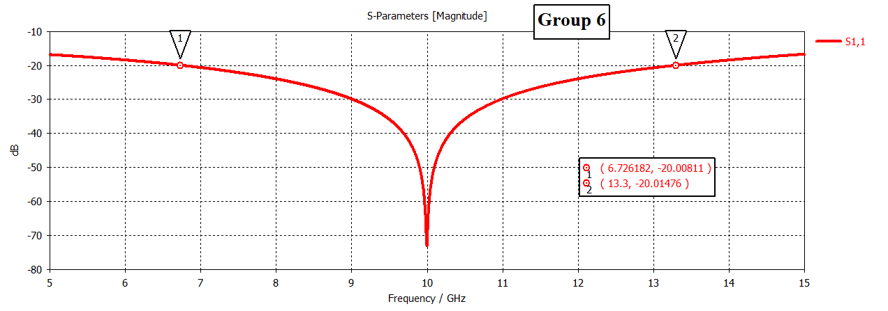
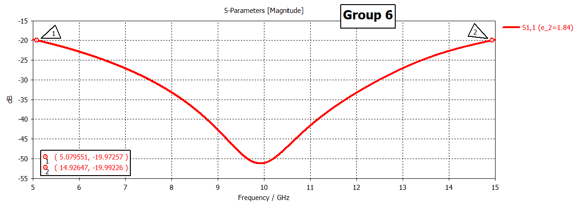
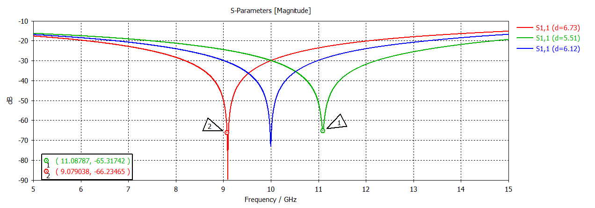
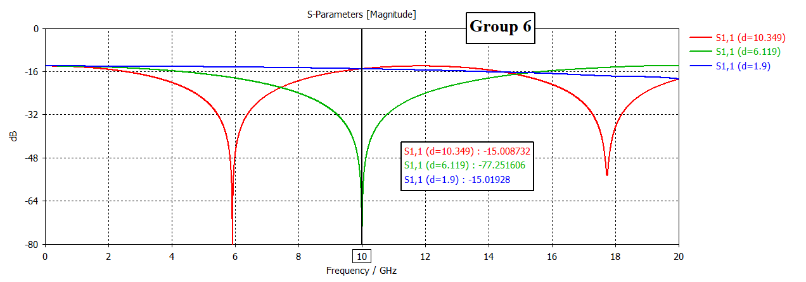

# Anti-Reflection Coating Design & Bandwidth Analysis
### EECG 252 — Electromagnetic Fields and Waves | Project 1B | Group 6
**Cairo University — Faculty of Engineering — Electronics & Communications Department**
**Instructor:** Dr. Mohamed Alaa · Spring 2026

---

## 📌 Overview

This project designs and analyzes a **quarter-wave anti-reflection coating (ARC)** for a glass substrate (εr = 2.25) at **10 GHz**. The work covers analytical derivation, MATLAB simulation, CST Studio Suite full-wave verification, and a two-layer bandwidth-enhanced design.

| Parameter | Value |
|---|---|
| Substrate | Glass, εr = 2.25 |
| Design frequency | 10 GHz |
| Single-layer coating εr | 1.50 |
| Single-layer thickness | 6.12 mm |

---

## 🎯 Project Tasks Covered

- **Task 7** — Single-layer matching condition derivation (impedance + quarter-wave thickness)
- **Task 8** — |Γ| vs frequency analytical sweep (±50% bandwidth)
- **Task 9** — 20 dB return-loss bandwidth extraction
- **Task 10** — Three-medium stack (air / coating / glass) simulated in CST, overlaid with analytical curve
- **Task 11** — Two-layer binomial coating design for wider bandwidth
- **Extension** — Thickness sensitivity analysis (±10% and beyond, critical error % for RL < 15 dB)
- **Cross-Group Comparison** — Bandwidth comparison with Group 9 (Alumina substrate, εr = 9.8)

---

## 📂 Repository Structure

```
.
├── README.md
├── report/
│   └── Fields_and_waves_Report___Group_6___Project_1B.pdf   # Final written report (max 20 pages)
├── matlab/
│   └── analytical_matlab.m             # Tasks 8, 9, 11, Extension — analysis & plots
├── cst/
│   ├── Task10.cst                      # Single-layer CST project file
│   ├── task_11.cst                     # Two-layer CST project file
│   └── extension_task/                 # Annotated CST screenshots (Group 6 label)
├── figures/
│   ├── S11_single_layer.png            # Single-layer S11, 20dB BW markers
│   ├── S11_double_layer.png            # Two-layer S11, 20dB BW markers
│   ├── S11_single_sweep.png            # ±10% thickness sensitivity sweep
│   └── error.png                       # Critical thickness error (RL = 15 dB)
└── presentation/
    └── Group6_ARC_Presentation.pptx    # 5-slide summary presentation
```

---

## 🔬 Key Results

### Single-Layer Design (Task 7–10)

| Quantity | Value |
|---|---|
| η_air | 377 Ω |
| η_glass | 251.3 Ω |
| Required coating impedance | 307.8 Ω |
| Coating εr | 1.50 |
| Coating thickness | 6.12 mm |
| S11 at 10 GHz (CST) | ≈ −72 dB |
| 20 dB return-loss bandwidth | 6.57 GHz (6.73 – 13.30 GHz) |



*S11 magnitude for the single-layer ARC. Markers at (6.73 GHz, −20 dB) and (13.3 GHz, −20 dB) define the 20 dB return-loss bandwidth, with a deep null of ≈ −72 dB at the 10 GHz design frequency.*

---

### Two-Layer Binomial Design (Task 11)

| Layer | εr | Impedance | Thickness |
|---|---|---|---|
| Layer 1 (air side) | 1.225 | 340.7 Ω | 6.78 mm |
| Layer 2 (glass side) | 1.84 | 281.0 Ω | 5.53 mm |

**Bandwidth improvement:** 6.57 GHz → 9.85 GHz (+50%)



*S11 magnitude for the two-layer binomial ARC. Markers at (5.08 GHz, −20 dB) and (14.93 GHz, −20 dB) give a 20 dB bandwidth of ≈ 9.85 GHz — a ~50% improvement over the single-layer design.*

---

### Extension — Thickness Sensitivity

**Part 1 — ±10% thickness error**



*S11 for d = 5.51 mm (−10%), d = 6.12 mm (nominal), and d = 6.73 mm (+10%). Both ±10% cases shift the matching null away from 10 GHz, reducing the return loss at 10 GHz from ~74 dB (nominal) to ~30 dB — still well above the 20 dB threshold.*

**Part 2 — Critical error for RL = 15 dB**



*Sweeping the coating thickness further shows that S11 at 10 GHz reaches −15 dB (RL = 15 dB) at d ≈ 10.35 mm (+69%) and d ≈ 1.9 mm (−69%). The single-layer design therefore tolerates a thickness error of approximately ±69% before falling below the 15 dB return-loss specification.*

| Thickness error | Return loss at 10 GHz |
|---|---|
| 0% | 74.2 dB |
| ±10% | ~30 dB |
| ±69% | ~15 dB (failure threshold) |

---

### Cross-Group Comparison (vs Group 9 — Alumina, εr = 9.8)

| Parameter | Group 6 (Glass) | Group 9 (Alumina) |
|---|---|---|
| Impedance ratio η₀/ηs | 1.50 | 3.13 |
| 20 dB Bandwidth | 6.57 GHz | 2.2 GHz |

A higher substrate εr produces a larger impedance mismatch, which makes the quarter-wave transformer more frequency-sensitive — hence Group 9's narrower bandwidth.

---

## 🛠️ How to Reproduce

### MATLAB
1. Open `matlab/analytical_matlab.m` in MATLAB.
2. Run the script — it prints impedance values, the 20 dB bandwidth, and plots |Γ| / Return Loss vs frequency for the single-layer design (Tasks 8–9), the two-layer design (Task 11), and the thickness sensitivity analysis (Extension).

### CST Studio Suite
1. Open `cst/Task10.cst` (CST Studio Suite 2025 recommended).
2. Structure: Air background / ARC coating brick (εr=1.5, 6.12 mm) / Glass brick (εr=2.25).
3. Boundary conditions: Electric (X), Magnetic (Y), Open (Z) — enforces the infinite plane-wave condition.
4. Run the Time Domain solver over 5–15 GHz and inspect **Results → S-Parameters → S1,1**.
5. Repeat with `cst/task_11.cst` for the binomial two-layer design.
6. For the extension task, use a Parameter Sweep on the coating thickness (see `cst/extension_task/`).

---

## 👥 Group Members & Contributions

| Member | Contribution |
|---|---|
| Anas Mohamed | Analytical derivation (Task 7) |
| Radwa Ahmed | |Γ| vs frequency analysis & bandwidth (Tasks 8–9) |
| Amin Mohamed | MATLAB verification |
| Ahmed Hassan | CST single-layer simulation & overlay (Task 10), Extension analysis |
| Ahmed Amir | Two-layer design & CST verification (Task 11) |

---

## 📜 Academic Integrity Note

All analytical derivations, MATLAB scripts, and CST simulations in this repository were independently developed by Group 6 for the assigned parameters (Glass substrate, εr = 2.25, 10 GHz), in accordance with the EECG 252 Academic Integrity and AI Use Policy.
